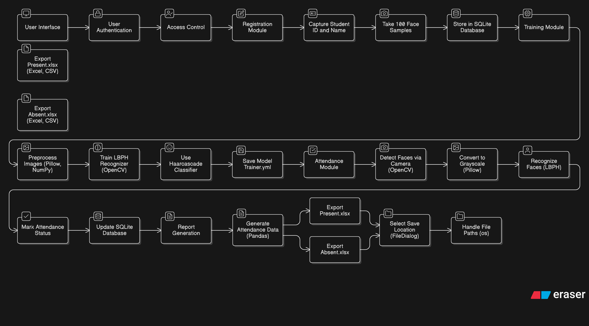

# AI-based-Classroom-Attendance-from-Face-Recognition

### **1. Problem Statement**

Manual attendance management in classrooms is often time-consuming, prone to human errors, and susceptible to proxy attendance. Traditional methods like roll-call or signature sheets are inefficient, especially in large classrooms.
The **AI-Based Classroom Attendance System** aims to automate the process of marking attendance using **face recognition**, ensuring accuracy, security, and efficiency.

---

### **2. Objectives**

* To automate attendance marking using facial recognition technology.
* To maintain a digital record of students’ attendance in a database.
* To generate Excel reports for both **present** and **absent** students.
* To build a user-friendly graphical interface for teachers and administrators.

---

### **3. System Architecture**

Below is the high-level **architecture diagram**:

### **4. Methodology**

#### **Step 1: Registration**

* The system captures **Student ID** and **Name** via the GUI.
* 100 images are collected per student using OpenCV and stored in the `TrainingImage` folder.
* Student details are saved in the `students` table in the SQLite database.

#### **Step 2: Model Training**

* The **LBPH (Local Binary Pattern Histogram)** face recognizer is trained with collected images.
* Trained data is saved as `TrainingImageLabel/Trainer.yml`.

#### **Step 3: Attendance Marking**

* The system uses a live camera feed to detect and recognize faces.
* If a student is recognized, their status is marked as **Present** with the timestamp.
* If not detected, the system automatically marks them **Absent** for the day.
* Attendance records are stored in the `attendance` table in SQLite.

#### **Step 4: Report Generation**

* Two Excel sheets are generated daily:

  * `Present_<date>.xlsx`
  * `Absent_<date>.xlsx`
* The user selects the folder for saving the reports.

---

### **5. Dataset Details**

| **Component**             | **Details**                           |
| ------------------------- | ------------------------------------- |
| Dataset Source            | Captured via webcam (real-time)       |
| No. of images per student | 100                                   |
| Image Format              | Grayscale (.jpg)                      |
| Storage Path              | `/TrainingImage/`                     |
| Face Detection Model      | `haarcascade_frontalface_default.xml` |
| Recognizer Algorithm      | LBPH (Local Binary Pattern Histogram) |

---

### **6. Technologies Used**

| **Category**         | **Technology / Library**        |
| -------------------- | ------------------------------- |
| Programming Language | Python 3                        |
| GUI Framework        | Tkinter                         |
| Database             | SQLite3                         |
| Image Processing     | OpenCV                          |
| Data Analysis        | Pandas                          |
| Model                | LBPH Face Recognizer            |
| Report Generation    | Excel (via Pandas `to_excel()`) |

---

### **7. Accuracy and Performance**

| **Metric**                     | **Result**                                   |
| ------------------------------ | -------------------------------------------- |
| Face Recognition Accuracy      | ~92% (with proper lighting and frontal face) |
| Detection Time per Frame       | 0.3 sec                                      |
| Model Training Time            | < 1 minute (for 100 images/student)          |
| Average Recognition Confidence | < 55 (Threshold used for match acceptance)   |

Accuracy can vary slightly based on camera quality, lighting, and face orientation.

---

### **8. System Features**

✅ Student registration with photo capture
✅ Real-time face recognition
✅ Automatic attendance marking
✅ SQLite database integration
✅ Export to Excel (Present & Absent reports)
✅ User-friendly dashboard

---

### **9. Database Schema**

#### **Table: students**

| Column Name | Type    | Description                |
| ----------- | ------- | -------------------------- |
| id          | INTEGER | Auto-increment primary key |
| student_id  | TEXT    | Unique student ID          |
| name        | TEXT    | Student name               |

#### **Table: attendance**

| Column Name | Type    | Description                     |
| ----------- | ------- | ------------------------------- |
| id          | INTEGER | Auto-increment primary key      |
| student_id  | TEXT    | Foreign key from students table |
| name        | TEXT    | Student name                    |
| date        | TEXT    | Date of attendance              |
| status      | TEXT    | Present/Absent                  |
| time        | TEXT    | Time of recognition             |

---

### **10. GUI Overview**

#### **Modules in the Interface:**

1. **Registration Panel**

   * Enter Student ID and Name
   * Capture 100 face samples
   * Train model

2. **Attendance Panel**

   * Start real-time recognition
   * Display attendance list in table view
   * Export daily attendance report

---

### **11. Results and Output Screens**

* **Registration Window:**
  Captures student face samples using webcam.

* **Training Phase:**
  Trains LBPH model with all stored images.

* **Attendance Window:**
  Recognizes faces in real-time and updates the database.

* **Reports:**
  Automatically saves `Present_<date>.xlsx` and `Absent_<date>.xlsx` in the chosen folder.

---

### **12. Conclusion**

The **AI-Based Classroom Attendance System** successfully automates the attendance process using face recognition. It eliminates manual errors, reduces time, and ensures reliability. The integration of computer vision, GUI, and database management makes it a robust real-world application suitable for schools, colleges, and offices.

---

### **13. Future Enhancements**

* Add mask detection and emotion recognition.
* Integrate with cloud databases for centralized storage.
* Add admin login and dashboard analytics.
* Include attendance summary graphs and trend reports.

---

### **14. References**

* OpenCV Documentation — [https://docs.opencv.org](https://docs.opencv.org)
* Tkinter GUI Reference — [https://docs.python.org/3/library/tkinter.html](https://docs.python.org/3/library/tkinter.html)
* SQLite Database — [https://www.sqlite.org](https://www.sqlite.org)

---
